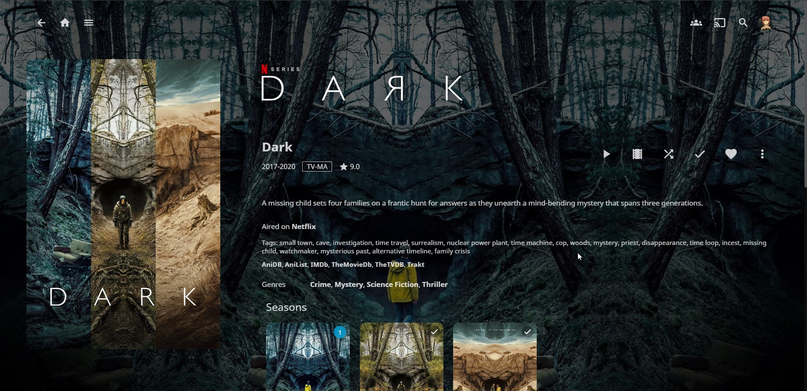
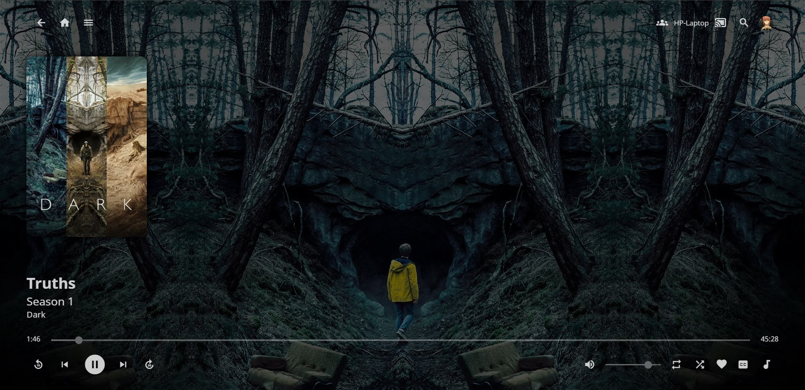
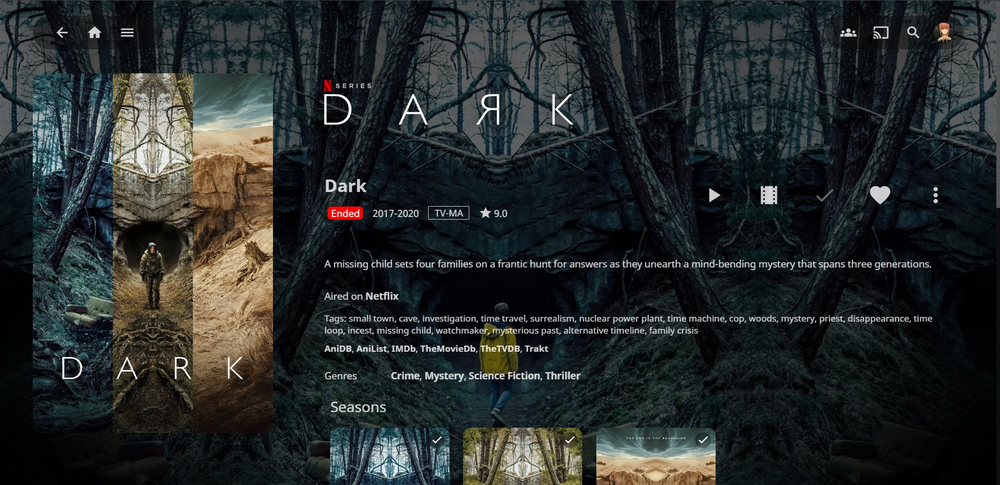
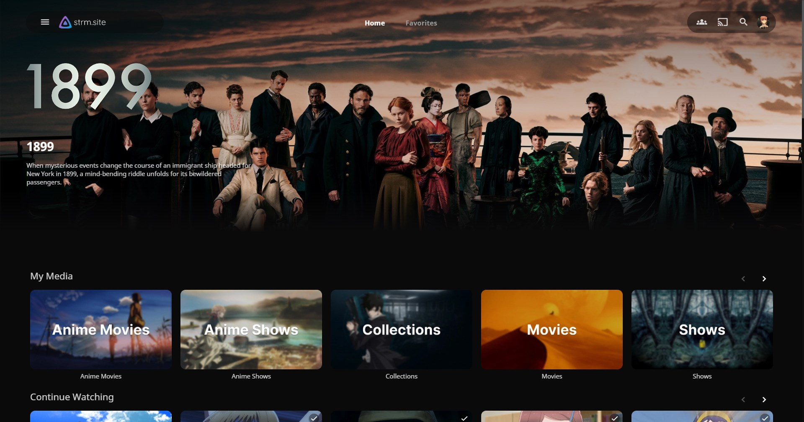

# Jellyfin Tweaks

Custom theme and script for jellyfin

## Theme
Based on [Ultrachromic](https://github.com/CTalvio/Ultrachromic)


**How to:**
- import stylesheet from the Dashboard
```css
@import url('https://cdn.jsdelivr.net/gh/radityaharya/custom-tweaks@main/jellyfin/theme.css');
```
    or
```css
@import url('https://static.radityaharya.me/radityaharya/custom-tweaks/main/jellyfin/theme.css');
```

**Changes:**

- details page

  
  changed header margin, detailRibbon color, hide itemBackdrop, cardImage

- queue page 

  
  controls such as navigation, send message, send text, etc. are hidden
  note: I use this page as a preview on a secondary screen, so I don't need the controls. Controls are still visible on layout-mobile 
## Scripts
Adds features such as:
- ctrl+f hotkey
- jellyfinApi calls
- per page function calls
- copy title on click
- status indicator
  
- staff list
  
- next episode air date
- hero section on home page (very janky)
  
- new features coming soon (maybe, idk what to add)

**How to:**
- Add script to ```/usr/share/jellyfin/web/```
- Add ```<script defer="defer" src="custom.js"></script>``` to the index.html head section
 
  or

  Add ```<script defer="defer" src="https://static.radityaharya.me/radityaharya/custom-tweaks/main/jellyfin/custom.js"></script>``` to the index.html head section 


